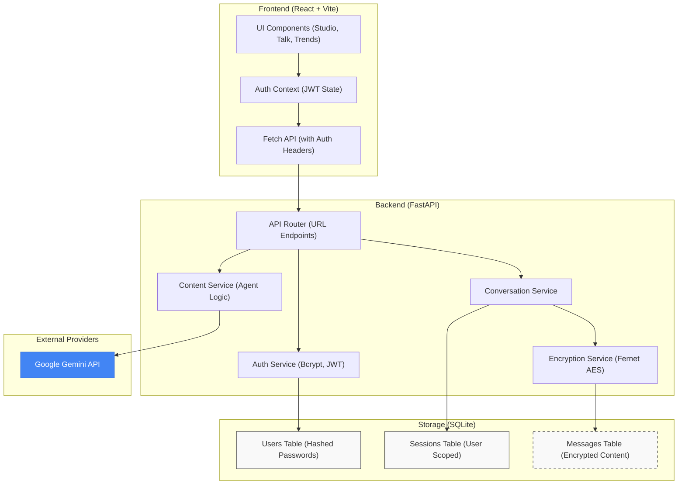

# AI Content Studio Agent - Architecture Diagram

---

## Technical Flow (Mermaid)

```mermaid
graph TD
    subgraph "Frontend (React + Vite)"
        UI["UI Components (Studio, Talk, Trends)"]
        AuthCtx["Auth Context (JWT State)"]
        Fetch["Fetch API (with Auth Headers)"]
    end

    subgraph "Backend (FastAPI)"
        Router["API Router (URL Endpoints)"]
        AuthSvc["Auth Service (Bcrypt, JWT)"]
        ContentSvc["Content Service (Agent Logic)"]
        ConvSvc["Conversation Service"]
        EncSvc["Encryption Service (Fernet AES)"]
    end

    subgraph "External Providers"
        Gemini["Google Gemini API"]
    end

    subgraph "Storage (SQLite)"
        UserTbl["Users Table (Hashed Passwords)"]
        SessTbl["Sessions Table (User Scoped)"]
        MsgTbl["Messages Table (Encrypted Content)"]
    end

    %% Interactions
    UI --> AuthCtx
    AuthCtx --> Fetch
    Fetch --> Router
    
    Router --> AuthSvc
    Router --> ContentSvc
    Router --> ConvSvc
    
    AuthSvc --> UserTbl
    ContentSvc --> Gemini
    ConvSvc --> EncSvc
    EncSvc --> MsgTbl
    ConvSvc --> SessTbl
    
    %% Styling
    style Gemini fill:#4285F4,color:#fff,stroke:#3b71db
    style UserTbl fill:#f9f9f9,stroke:#333
    style SessTbl fill:#f9f9f9,stroke:#333
    style MsgTbl fill:#f9f9f9,stroke:#333,stroke-dasharray: 5 5
```
